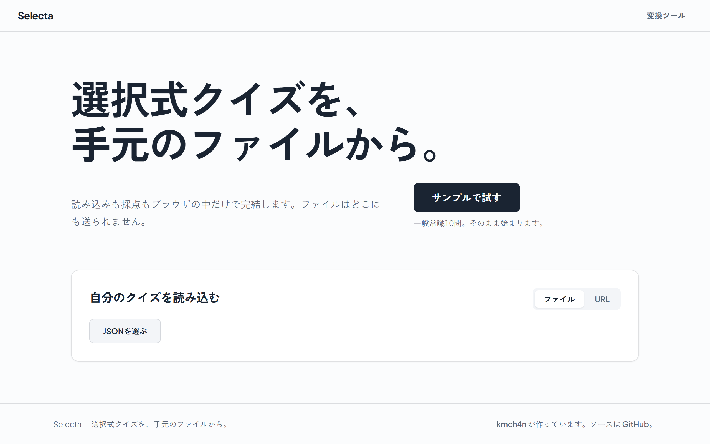
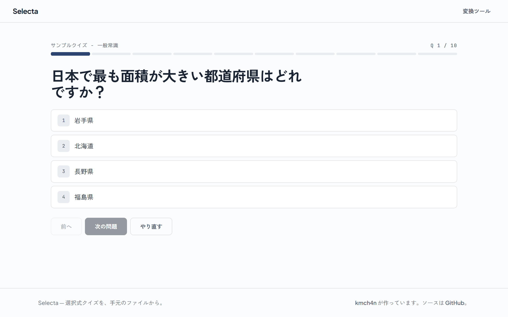
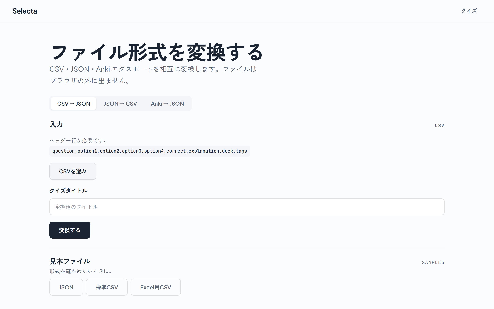

<div align="center">


# Selecta

**手元のファイルや URL から、選択式クイズを。**

読み込みも採点もブラウザの中だけで完結する、Anki 互換の選択式クイズ PWA。

[](https://astro.build/)
[](https://www.typescriptlang.org/)
[](https://vite-pwa-org.netlify.app/)
[](LICENSE)

[**selecta.kmchan.jp**](https://selecta.kmchan.jp/) で公開中

</div>



Selecta は、選択式クイズを JSON ファイルや URL から読み込み、ブラウザで解いて
復習するための PWA です。読み込み・採点・復習まですべてクライアントサイドで完結し、
サーバは不要。ファイルはブラウザの外に出ません。CSV・JSON・Anki
エクスポートの相互変換ツールも備えています。

> [!TIP]
> `?source=<クイズのURL>` を付けたリンクを開くだけで、そのクイズが自動で始まります。
> 誰かに問題集を渡すときは、リンクを送るだけで済みます。

## 特長

- **選択式プレイヤー** — **2 択以上**の設問に解答。正誤で埋まっていくアンサートラックと、
  キーボードショートカット（数字キー `1`–`9`、10 番目は `0`、`Enter`）を備える。
- **柔軟な読み込み** — ローカルの JSON ファイルを選ぶか、1 つ以上の URL を渡して
  複数のクイズセットを連続で出題する。
- **共有リンク** — `?source=` で自動読み込み。パラメータを繰り返せば
  （`?source=a.json&source=b.json`）複数を連結できる。
- **間違いだけ復習** — 誤答した設問を内容ハッシュで記録し、あとから苦手だけを解き直せる。
- **選択肢シャッフル** — オン/オフできる設定。番号ではなく内容で覚えられる。
- **形式変換** — CSV ⇄ JSON、Anki エクスポート → JSON。Excel で開ける
  （BOM 付き UTF-8）CSV 出力にも対応。
- **PWA** — インストール可能・オフライン対応。
- **quiet なテーマ** — 近白の紙・濃紺の墨・一色の差し色。ライトが既定で、
  ボタン一つでダークに切り替えられる（OS 設定には追従しない）。

|             クイズを解く             |             形式を変換する             |
| :----------------------------------: | :------------------------------------: |
|  |  |

## クイックスタート

Selecta は [PNPM](https://pnpm.io/) を使います。

```sh
pnpm install
pnpm run dev       # http://localhost:4321
```

> [!NOTE]
> クイズを作る・遊ぶだけならインストールは不要です。公開サイトにファイルや URL を
> 渡すだけで動きます。上記はローカルで開発する場合の手順です。

## ドキュメント

| ドキュメント | 内容 |
| --- | --- |
| [クイズデータ形式](docs/quiz-format.md) | JSON のスキーマと変換ツールの仕様 |
| [開発ガイド](docs/development.md) | セットアップ・技術スタック・アーキテクチャ概要 |
| [デザイン仕様](design.md) | デザインシステムの判断根拠（英語） |

---

MIT ライセンス · © [kmch4n](https://kmchan.jp)
